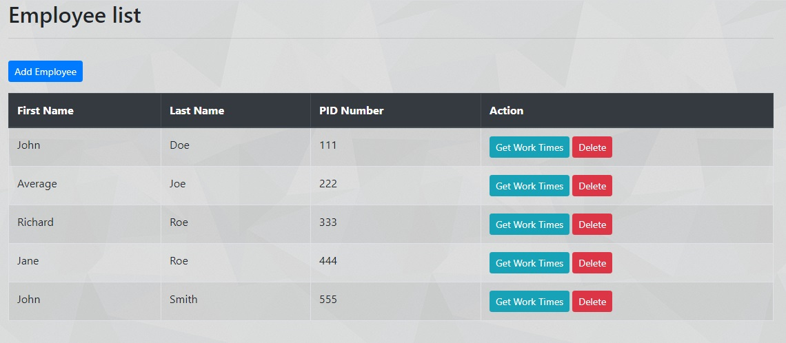
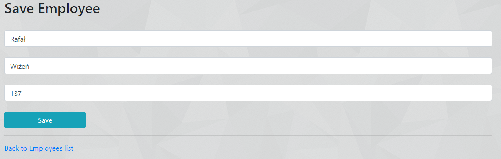
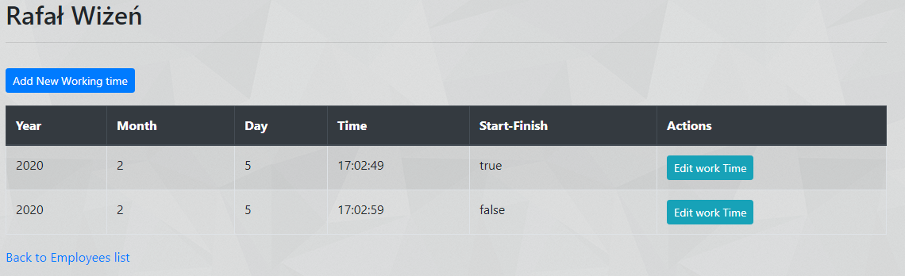
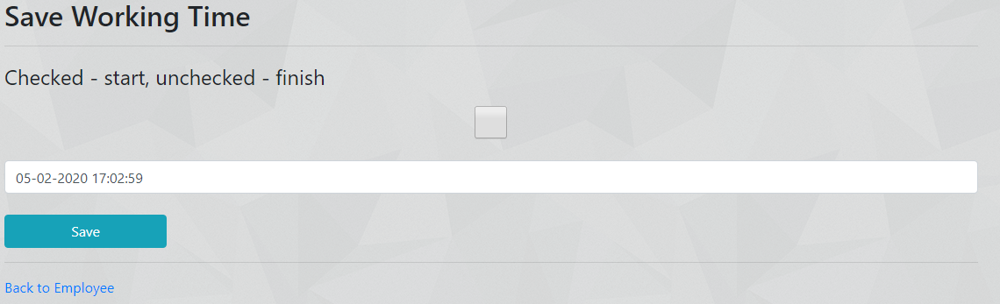
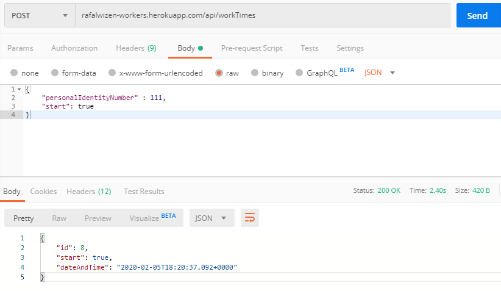

# Workers

>Application made to add employees to database and to add working times. It's uploaded on heroku:
[rafalwizen-workers.herokuapp.com](rafalwizen-workers.herokuapp.com)

## Table of contents
* [General info](#general-info)
* [Technologies](#technologies)
* [Screenshots](#screenshots)
* [Status](#status)
* [Features to do](#features-to-do)

## General info
Inspiration to do this application was course made by Chad Darby (Spring & Hibernate for Beginners) and my job where I have system to track working time. Already this application has features to add employees to database and to keep working times in database. It's already possible add working times to database by API and editing existing working times by html page.

## Technologies
* Java - version 1.8
* Spring - version 5.1.9.RELEASE
* Hibernate - version 5.4.8.RELEASE
* Thymeleaf - version 3.0.11.RELEASE
* HTML - version 5
* CSS - version 3
* Bootstrap - version 4.3.1
* Maven - version 4.0.0
* MySQL driver

## Screenshots

There is possibility to add working time by REST (POST) endpoint 
rafalwizen-workers.herokuapp.com/api/workTimes

## Status

Project is still being developed.

## Features to do
Add unit to delete work times in database.

Add different users to use only specific part of program (E.g. user, manager, administrator)

Fix server time